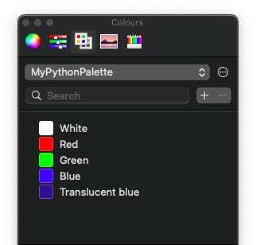
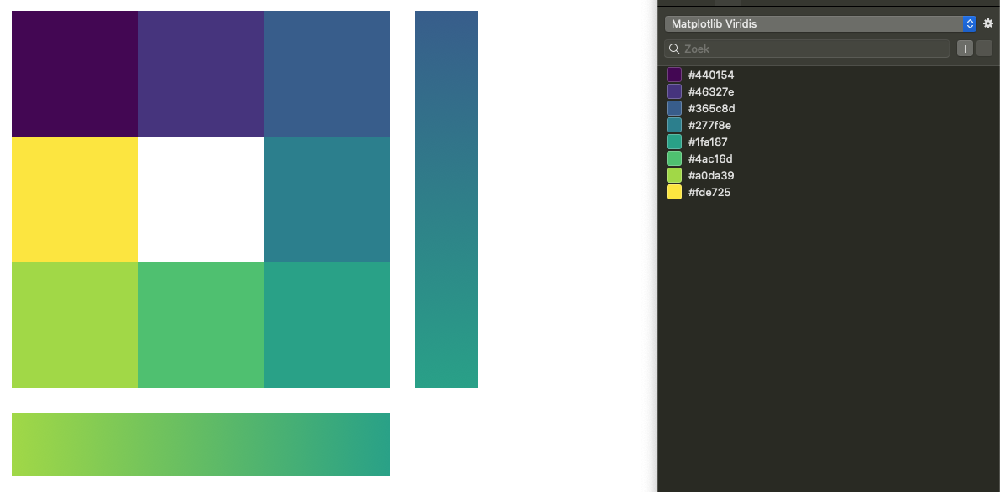

# ColorpaletteConverter

Export colorpalettes in Python to the MacOS color helper. 



## Usage

```python
import colorpaletteconverter as cv

# Create the palette, named "MyPythonPalette"
mypalette = cv.Palette("MyPythonPalette")

# Add a color using a key e.g. "White" and color described by (r, g, b, a)
mypalette.add_color((1,1,1,1), "White")
mypalette.add_color((1,0,0,1), "Red")
mypalette.add_color((0,1,0,1), "Green")
mypalette.add_color((0,0,1,1), "Blue")
mypalette.add_color((0,0,1,0.5), "Translucent blue")

# Save it to the default location. This will make it visible in the MacOS color palette.
mypalette.save()

# To save it to an alternative location
mypalette.save("mypalette.clr")
```

More examples in the [tutorial notebook](https://github.com/Rutger0000/colorpalette-converter/blob/master/Tutorial.ipynb).

## Use cases
This package helps to convert color palettes from for example Matplotlib or Seaborn, or your custom generated color palettes to the MacOS Color helper.

- Matplotlib color palettes: https://matplotlib.org/stable/tutorials/colors/colormaps.html
- Seaborn color palettes: https://seaborn.pydata.org/tutorial/color_palettes.html

The colors can be used in application like Apple Pages, Apple Keynote, Apple Numbers, Apple Final Cut Pro X, Microsoft Word, Microsoft Powerpoint and more.


